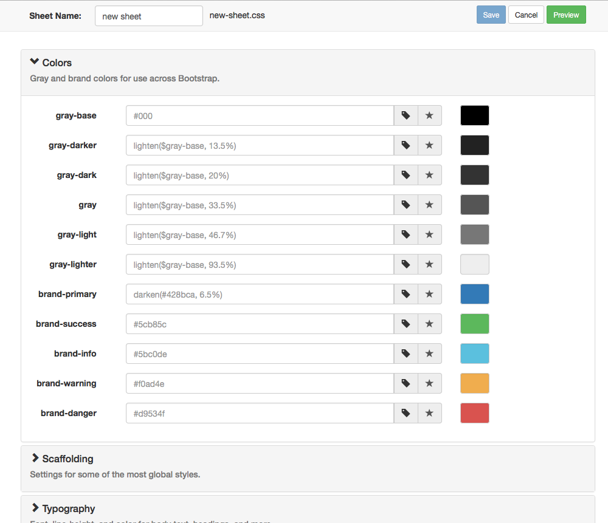
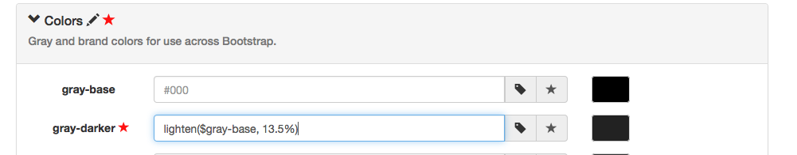
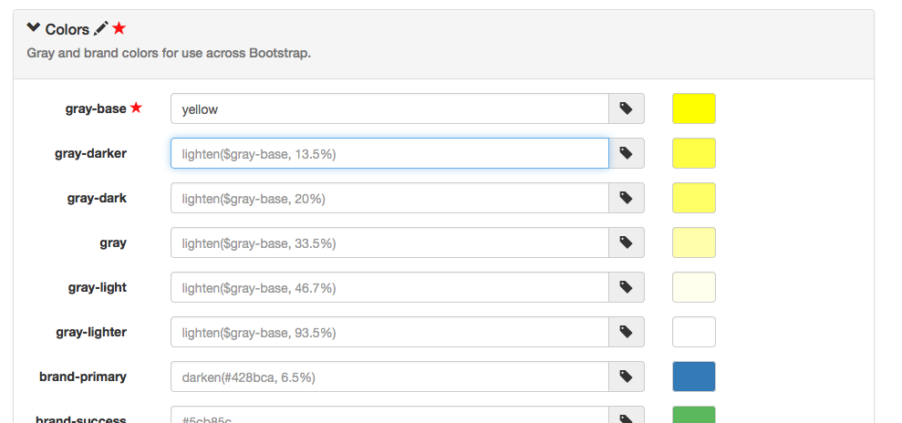
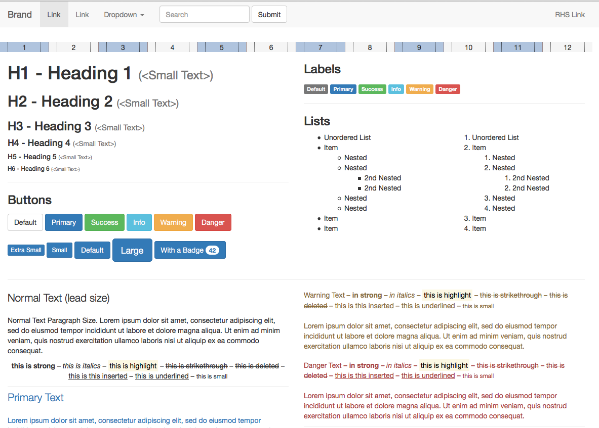

Using The Sheet Editor
**********************

BSEditor is organized into three classes: :class:`.Version`, :class:`.Sheet`
and :class:`.PreviewSheet`.  A :class:`.Version` provides meta-information to
the library corresponding to the versions of Bootstrap supported.  To use the
version of Bootstrap that ships with the library, use the management command:

.. code-block:: bash

    $ manage.py defaultversion

Once a :class:`.Version` exists, you can create new :class:`.Sheet` objects
using the ``django admin``.  When viewing the :class:`.Version` change list,
each :class:`.Version` will have a ``Create Sheet`` link.  Clicking this will
create a new :class:`.Sheet` object and open the Sheet Editor.

The Sheet Editor is divided into sections based on the Bootstrap version
template file.  You can enter any valid Bootstrap variable value in the entry
fields.  As you edit, you will see indicators on the section header and item
to show it is different from the base version.  

Unedited fields will show washed out text with the contents of the default.
To make it easier to start with the default before editing, you can press the
"tag" icon to the right of the entry field to paste the default contents into
the field.

Notice that items that have been edited but not saved will be marked with a
red star.  Any section that has an edited but unsaved item in it will also be
marked with a red star.  Sections that have customizations in them will have a
pencil icon.  This makes it easy when loading a saved sheet with a list of
closed sections to see where you have customized your style sheet.

When you edit a Bootstrap variable that represents a colour, when you change
focus from the edit field, the colour swatches on the right-hand-side will
update.  The server is aware of all dependencies in the variables and will
update even formulaic values.  In the image below, the base grey has been
changed to yellow, notice how all the related grey items update as well.

Saving will return you back to the django admin.

Previews
++++++++

You can preview the choices you have made either from the :class:`.Sheet`
change list in the django admin, or using the "Preview" button in the Sheet
Editor.  This will show a page in a new tab/window that shows the major
components of Bootstrap and how they will be effected by your selections.

If you use the "Preview" button from the Sheet Editor, the sheet is not saved,
but the current unsaved values are used for the preview.  This allows you to
check out your work before making it permanent.

Version Variables
+++++++++++++++++

From the :class:`.Version` change list screen in the django admin, each
:class:`.Version` has a link called "Show Variables".  This will open a new
tab/window that contains the JSON contents of the :class:`.Version` object.
This can be useful for debugging or understanding the relationships between
the variables in the Bootstrap template.

Management Commands
*******************

defaultversion
++++++++++++++

This command loads the default versions of Bootstrap that ships with the
library.  It takes no parameters.

Example:

.. code-block:: bash

    $ manage.py defaultversion

createversion
+++++++++++++

Use this command to create a new :class:`.Version` object.  Parameters:

name
    Human readable name to call this :class:`.Version` instance when created

custom SASS file
    Location of the custom SASS file (see `Adding A Bootstrap Version`_)

bootstrap variables file
    Location of the bootstrap variables file to read as a template.  For
    Bootstrap 3.3 this is found in "bootstrap/_variables.scss".

Example:

.. code-block:: bash

    $ manage.py createversion 3.3.5 variables.scss custom.sass

Adding A Bootstrap Version
**************************

To add a version of Bootstrap besides the one that comes with the library, you
will need to download the Bootstrap Sass source code.  Depending on the
version of Bootstrap you are trying to use, this should be available on the
Bootstrap "Getting Started" page of the documentation.

Any :class:`.Version` you create needs to be based on a "sass" file.  A simple
example (the one used with the default version) is "custom.sass" found
underneath the "bseditor/static/sass" directory.  This file needs to define
where to import Bootstrap from:

custom.sass::

    $icon-font-path:"https://maxcdn.bootstrapcdn.com/bootstrap/3.3.5/fonts/";

    @import "bootstrap"  

This example also defines the font path to come from the CDN, if you don't do
this you'll need to manually handle font bundles after you deploy.  As you
can't edit the fonts themselves with this package, the simplest thing to do is
use the CDN.

Each instance of a :class:`.Version` is based on a Bootstrap variables
definition file.  This is usually found in the Bootstrap hierarchy as
"bootstrap/_variables.scss".  

Once you've created a "custom.sass" and found your "_variables.scss" file, you
simply run the `createversion`_ command using this content.

Example
+++++++

In your django project directory, download and unpack the Bootstrap Sass
source, and create a "custom.sass" file:

.. code-block:: bash

    $ tar xvfz bootstrap-sass-3.3.5.tar.gz
    $ pushd bootstrap-sass-3.3.5/assets/stylesheets
    $ vi custom.sass

Use the contents from above, or copy the one provided in
"bseditor/static/sass".

Once you have the file, run the ``createversion`` command from your project
directory:

.. code-block:: bash

    $ popd
    $ ./manage.py createversion 3.3.5 bootstrap-sass-3.3.5/assets/stylesheets/bootstrap/_variables.scss bootstrap-sass-3.3.5/assets/stylesheets/custom.sass 
